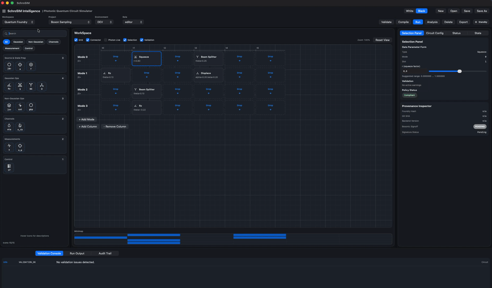

<p align="center">
  <!-- Core Languages & Platform -->
  
  
  
  
  
  

  <!-- Project Signals -->
  <a href="https://github.com/DennisWayo/SchroSIM/actions/workflows/ci.yml"></a>
  <a href="https://github.com/DennisWayo/SchroSIM/actions/workflows/docs-pages.yml"></a>
  <a href="https://pypi.org/project/schrosim/"></a>
</p>

## SchroSIM

SchroSIM is a continuous-variable (CV) photonic quantum simulation stack for designing, compiling, and simulating hardware-like photonic quantum circuits. The open-source core combines an SDK for developer integration and a CLI for terminal-based circuit execution.

Built for students, researchers, and quantum foundry engineers, SchroSIM provides an exact-solution simulation path for tractable circuits and scalable backend options for larger workflows.

> Documentation: 
Full project documentation is in [SchroSIM Docs](https://denniswayo.github.io/SchroSIM/).

> "SchroSIM core (compiler, runtime, SDK/CLI, docs, and public examples) is open source under MIT for research, education, and downstream studies.
Enterprise-only capabilities (advanced UI, partner-specific integrations, and commercialization-focused IP) are developed in enterprise mode and are intended to live in a separate private distribution path.
This boundary keeps reproducible scientific workflows public while allowing confidential enterprise delivery for hardware and industrial partners."



The enterprise UI is focused on:
1. project-scoped circuit workflows,
2. backend-aware execution policies,
3. analysis views for simulation and QEC outcomes.

Status: enterprise-track active development.

### The Need
Photonic and CV workflows need fast iteration across modeling, backend selection, and error-correction validation. In practice, teams often lose time moving between disconnected tools for design, compilation, execution, and debugging.

SchroSIM is built to make those workflows practical in one platform, with reproducible runs and backend-aware execution policies that support both research and pre-hardware validation.

### Circuit and Runtime Failure Modes (Why They Matter)
The failure modes below are workflow-level circuit/runtime issues common in photonic and CV pipelines. They are not, by default, indicators of defects in SchroSIM itself.

Even promising photonic circuit designs can fail at compile time or simulation time. Common failure modes include:
1. non-physical parameter sets (invalid squeezing ranges, inconsistent phase settings, or state assumptions),
2. backend/model mismatch (idealized circuits mapped to noisy or hardware-constrained targets without adaptation),
3. numerical limits (insufficient cutoff dimensions, precision issues, or unstable optimization settings),
4. hardware-like constraints (unsupported operations, timing/order conflicts, and foundry policy limits).

SchroSIM helps surface these issues early with backend-aware checks, reproducible runtime configuration, and analysis views that explain where and why execution failed.

### Model-Exact Scope
SchroSIM provides model-exact simulation for tractable Gaussian CV workloads under the stated model assumptions. For larger, non-Gaussian-heavy, or more hardware-constrained cases, SchroSIM supports backend-aware execution paths that use controlled approximations for scalability and runtime practicality.

Use this rule of thumb:
1. use the model-exact Gaussian path for ground-truth studies, validation, and small-to-mid scale circuit analysis,
2. use scalable/hybrid/Fock policy-targeted paths as controlled approximations for larger experiments and pre-hardware iteration.

### Design-to-Result Workflow
1. define a circuit in project JSON (public workflow) or design it in the enterprise UI (private track),
2. compile to backend-aware intermediate/runtime configuration,
3. run static checks for operation support and constraint compatibility,
4. execute simulation on selected path (model-exact Gaussian or controlled approximation backend path),
5. analyze observables, runtime metrics, and QEC outcomes,
6. iterate parameters, backend, and correction strategy with reproducible settings.

### Failure Diagnostics in SchroSIM
| Failure class | Typical symptom | Likely cause | Mitigation |
|---|---|---|---|
| Non-physical parameters | compile rejection or invalid state warning | squeezing/phase/state assumptions outside valid region | enforce parameter bounds and validate state configuration before execution |
| Backend mismatch | operator unsupported or policy violation | circuit authored for ideal model but run on constrained target | remap operations to backend-supported primitives and recompile |
| Numerical instability | divergent metrics or inconsistent repeated results | cutoff too small, unstable optimizer, precision loss | increase cutoff, tune solver/optimizer settings, fix deterministic seeds |
| Resource overrun | excessive runtime/memory | circuit scale exceeds selected method limits | switch backend mode, reduce circuit depth/modes, profile bottlenecks |
| Constraint conflict | schedule/order/timing failure | gate ordering violates foundry/runtime constraints | use compiler ordering hints and backend-specific scheduling policies |

### Hardware-Like and Foundry Constraints
SchroSIM is built for pre-hardware realism. Backend-aware compilation and runtime policy checks help teams identify unsupported operations, ordering constraints, and integration risks before tape-out or hardware queue submission.

### Numerical Reliability and Reproducibility
For technical studies, use fixed seeds, pinned runtime configuration, and explicit cutoff/precision settings. This makes experiments repeatable and simplifies regression checks across backend changes.

### Project Maturity
SchroSIM is under active development. Core workflows for circuit design, compilation, execution, and analysis are available, with ongoing expansion of backend coverage and diagnostics depth.

### Toolchain Prerequisites
SchroSIM source workflows require Python, Swift, and Rust toolchains.

Verify your environment:
```bash
python3 --version
pip --version
swift --version
rustc --version
cargo --version
```

### Quick Start
For the published Python package:
```bash
pip install schrosim
schrosim --help
```

The Python package provides the `schrosim` launcher and helper entry points.
On macOS, published wheels include a native `schrosim-cli` backend, so `pip install schrosim` is runnable directly.
On other platforms, install/build `schrosim-cli` yourself or run from source with Swift.

For this source repository:
```bash
swift run schrosim-cli --help
```

Python 3 is required for helper scripts and packaging workflows.

### CLI: Run Demos
Run Boson Sampling:
```bash
schrosim run examples/runtime_default_foundry.json --backend hybrid
```

Run Quantum Error Correction:
```bash
schrosim run examples/cv/qec_single_logical_gkp_memory_mvp.json --backend hybrid
```

### Optional: Run from CLion
CLion is recommended for contributor workflows (debugging, stepping through code, and managing run configurations). Keep CLI commands as the primary execution path for reproducible runs and CI alignment.

### Ecosystem Comparison (High-Level)
| Framework | Primary focus | Photonic scope | Execution path | Typical fit |
|---|---|---|---|---|
| [SchroSIM](https://denniswayo.github.io/SchroSIM/) | CV photonic circuit simulation with backend-aware compilation, runtime diagnostics, and QEC-oriented workflows | Gaussian + selected non-Gaussian workflows (JSON/CLI flow) | Local classical simulation (`gaussian`, `fock`, `hybrid`; CPU/Metal where available) | Reproducible research workflows, QEC scenario studies, validation pipelines, and hardware-like prechecks |
| [Strawberry Fields](https://strawberryfields.ai/photonics/) | Full-stack Python framework for photonic quantum computing | Continuous-variable photonics, Gaussian/Fock-style workflows | Local simulators + remote execution on Xanadu photonic hardware/cloud | CV algorithm research and cloud photonic experiments |
| [Perceval](https://perceval.quandela.net/docs/v1.1/) | Linear optics quantum framework | Discrete-variable / linear-optics photonic circuits | Local simulation + remote execution on simulator/QPU platforms | Linear-optics experiment design, sampling, and cloud QPU workflows |
| [PennyLane](https://docs.pennylane.ai/) | Differentiable quantum programming and quantum ML framework | Photonics via plugins (not photonic-only core) | Local simulators + hardware integrations via devices/plugins | Hybrid quantum-classical ML workflows, gradient-based circuit research, and QEC prototyping/education workflows |
| [Qibo](https://qibo.science/qibo/stable/) | General quantum middleware (simulation + hardware control ecosystem) | Not photonic-specific by default | Classical simulation backends + self-hosted hardware control stack | General quantum algorithm development and hardware-control integration |
| [QuTiP](https://qutip.readthedocs.io/en/latest/) | Open quantum-system dynamics and quantum optics simulation toolkit | Broad quantum optics modeling (not photonic-QPU specific) | Local numerical simulation toolkit | Physics-first quantum optics/open-system simulation and education |
